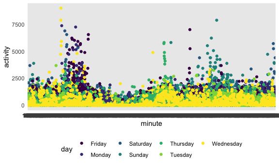

P8105 Homework 3
================
Rebekah Hughes

The code chunk below loads the tidyverse package and sets up the overall
structure of plots that will be used in this homework.

``` r
library(tidyverse)
```

    ## ── Attaching packages ────────────────────────────────────────────────────── tidyverse 1.3.0 ──

    ## ✓ ggplot2 3.3.2     ✓ purrr   0.3.4
    ## ✓ tibble  3.0.3     ✓ dplyr   1.0.2
    ## ✓ tidyr   1.1.2     ✓ stringr 1.4.0
    ## ✓ readr   1.3.1     ✓ forcats 0.5.0

    ## ── Conflicts ───────────────────────────────────────────────────────── tidyverse_conflicts() ──
    ## x dplyr::filter() masks stats::filter()
    ## x dplyr::lag()    masks stats::lag()

``` r
knitr::opts_chunk$set(
  fig.width = 6,
  fig.asp = .6,
  out.width = "90%"
)

theme_set(theme_minimal() + theme(legend.position = "bottom"))

options(
  ggplot2.continuous.colour = "viridis",
  ggplot2.continuous.fill = "viridis"
)

scale_colour_discrete = scale_color_viridis_d
scale_fill_discrete = scale_fill_viridis_d
```

## Problem 1

The following code loads the instacart dataset for this problem, without
including it in the local data directory.

``` r
library(p8105.datasets)
data("instacart")
```

The instacrt dataset includes data regarding items ordered from a sample
of instacart users in 2017. There are 15 variables and 1384617
observations in the dataset. The data is a data frame with a mixture of
character and numeric variables. Some key variables to note are the
product names, number of times products were reordered, the aisle the
items were ordered from and when the items were ordered during the day.
The average number of times items were reordered was 0.5985944 and the
average time of day that items were ordered during was during hour
13.5775922.

The following code chunk determines the number of aisles and aisle with
most items ordered from.

``` r
instacart %>% 
  distinct(aisle) %>% 
  count()
```

    ## # A tibble: 1 x 1
    ##       n
    ##   <int>
    ## 1   134

## Problem 2

``` r
accel_df =
  read_csv("./data/accel_data.csv") %>% 
  janitor::clean_names() %>% 
  mutate(weekend_or_weekday = if_else(day %in% c("Monday", "Tuesday", "Wednesday", "Thursday", "Friday"), "weekday", "weekend")) %>% 
  pivot_longer(
  activity_1:activity_1440,
  names_to = "minute",
  names_prefix = "activity_",
  values_to = "activity"
)
```

    ## Parsed with column specification:
    ## cols(
    ##   .default = col_double(),
    ##   day = col_character()
    ## )

    ## See spec(...) for full column specifications.

``` r
day_totals =
  accel_df %>% 
  group_by(day_id, day) %>% 
  summarize(total_activity = sum(activity)) %>% 
  pivot_wider(
    names_from = day,
    values_from = total_activity
  ) %>% 
  knitr::kable(digits = 2)
```

    ## `summarise()` regrouping output by 'day_id' (override with `.groups` argument)

``` r
accel_df %>%
  ggplot(aes(x = minute, y = activity, color = day)) +
  geom_point(position = "dodge")
```

    ## Warning: Width not defined. Set with `position_dodge(width = ?)`



## Problem 3

``` r
library(p8105.datasets)
data("ny_noaa")
```

``` r
weather_df =
  ny_noaa %>% 
  mutate(date = as.character(date)) %>% 
  separate(date, c("year", "month", "day")) %>% 
  mutate(prcp = prcp/10) %>% 
  mutate(tmax = as.numeric(tmax), tmin = as.numeric(tmin)) %>% 
  mutate(tmax = tmax/10) %>% 
  mutate(tmin = tmin/10)
```
