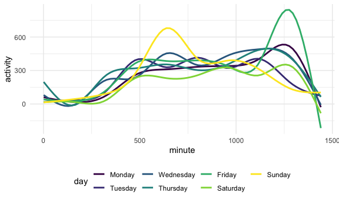

P8105 Homework 3
================
Rebekah Hughes

## Problem 1

The following code loads the `instacart` dataset for this problem.

``` r
data("instacart")
```

The `instacart` dataset includes data regarding items ordered from a
sample of instacart users in 2017. The observations are on the level of
item ordered by the various users. There are 15 variables and 1384617
observations in the dataset. The data is a data frame with a mixture of
character and numeric variables. The variables included contain
information on the products ordered, the user, the time of day and week
that the products were ordered, the aisle and the department the
products were ordered from. Some noteworthy variables are the day of the
week, the product, the aisle, and the time of day the products were
ordered.

The following code chunk determines the number of aisles and aisles with
the most items ordered from.

``` r
instacart %>%
  count(aisle) %>% 
  arrange(desc(n))
```

    ## # A tibble: 134 x 2
    ##    aisle                              n
    ##    <chr>                          <int>
    ##  1 fresh vegetables              150609
    ##  2 fresh fruits                  150473
    ##  3 packaged vegetables fruits     78493
    ##  4 yogurt                         55240
    ##  5 packaged cheese                41699
    ##  6 water seltzer sparkling water  36617
    ##  7 milk                           32644
    ##  8 chips pretzels                 31269
    ##  9 soy lactosefree                26240
    ## 10 bread                          23635
    ## # … with 124 more rows

Using the above code chunk, it can be determined there are 134 aisles
and the aisles with the most items ordered from them are fresh
vegetables, fresh fruits, and packaged vegetables and fruits.

The following code chunk makes a plot showing number of items ordered on
each aisle.

``` r
instacart %>%
  count(aisle) %>% 
  filter(n > 10000) %>% 
  mutate(
    aisle = factor(aisle),
    aisle = fct_reorder(aisle, n)
  ) %>% 
  ggplot(aes(x = aisle, y = n)) +
  geom_point() +
  theme(axis.text.x = element_text(angle = 90, vjust = 0.5, hjust = 1))
```


The plot starts out with the items ordered the least, such as butter and
oils and vinegars and progresses to the items ordered the most, as noted
from the previous code chunk.

The following code shows the three most popular items ordered from the
baking ingredients, dog food care, and packaged vegetables aisles.

``` r
instacart %>% 
  filter(aisle %in% c("baking ingredients", "dog food care", "packaged vegetables fruits")) %>% 
  group_by(aisle) %>% 
  count(product_name) %>% 
  mutate(rank = min_rank(desc(n))) %>% 
  filter(rank < 4) %>% 
  arrange(aisle, rank) %>% 
  knitr::kable()
```

| aisle                      | product\_name                                 |    n | rank |
| :------------------------- | :-------------------------------------------- | ---: | ---: |
| baking ingredients         | Light Brown Sugar                             |  499 |    1 |
| baking ingredients         | Pure Baking Soda                              |  387 |    2 |
| baking ingredients         | Cane Sugar                                    |  336 |    3 |
| dog food care              | Snack Sticks Chicken & Rice Recipe Dog Treats |   30 |    1 |
| dog food care              | Organix Chicken & Brown Rice Recipe           |   28 |    2 |
| dog food care              | Small Dog Biscuits                            |   26 |    3 |
| packaged vegetables fruits | Organic Baby Spinach                          | 9784 |    1 |
| packaged vegetables fruits | Organic Raspberries                           | 5546 |    2 |
| packaged vegetables fruits | Organic Blueberries                           | 4966 |    3 |

The results in the table show that light brown sugar, snack sticks
chicken and rice recipe dog treats, and organic baby spinach were the
top selling items of each category.

The following code chunk creates a table showing the average time of day
that Pink Lady Apples and Coffee Ice Cream were ordered.

``` r
instacart %>% 
  filter(product_name %in% c("Pink Lady Apples", "Coffee Ice Cream")) %>% 
  group_by(product_name, order_dow) %>% 
  summarize(mean_hour = mean(order_hour_of_day)) %>% 
  pivot_wider(
    names_from = order_dow,
    values_from = mean_hour
  ) %>% 
  knitr::kable()
```

| product\_name    |        0 |        1 |        2 |        3 |        4 |        5 |        6 |
| :--------------- | -------: | -------: | -------: | -------: | -------: | -------: | -------: |
| Coffee Ice Cream | 13.77419 | 14.31579 | 15.38095 | 15.31818 | 15.21739 | 12.26316 | 13.83333 |
| Pink Lady Apples | 13.44118 | 11.36000 | 11.70213 | 14.25000 | 11.55172 | 12.78431 | 11.93750 |

According to the above table, it appears that Pink Lady Apples are
ordered earlier in the day than Coffee Ice Cream for most days of the
week.

## Problem 2

The following code load, tidies and wrangles the accelerometer dataset.

``` r
accel_df =
  read_csv("./data/accel_data.csv") %>% 
  janitor::clean_names() %>% 
  mutate(weekend_or_weekday = if_else(day %in% c("Monday", "Tuesday", "Wednesday", "Thursday", "Friday"), "weekday", "weekend"),
         day = factor(day),
         day = fct_relevel(day, c("Monday", "Tuesday", "Wednesday", "Thursday", "Friday", "Saturday", "Sunday"))) %>% 
  pivot_longer(
  activity_1:activity_1440,
  names_to = "minute",
  names_prefix = "activity_",
  values_to = "activity"
) %>% 
  mutate(minute = as.numeric(minute))
```

The accelerometer dataset contains data regarding the amount of activity
for one person over a 24 hour period for 5 weeks. There are 6 variables
and 50400 observations in the dataset. Key variables to note are the
activity and minute variables, the day variable, the week variable, and
the weekday versus weekend variable.

The next code chunk creates and displays a table with the total activity
across a day.

``` r
accel_df %>% 
  group_by(day, day_id) %>% 
  summarize(total_activity = sum(activity)) %>% 
  pivot_wider(
    names_from = day,
    values_from = total_activity
  ) %>%
  knitr::kable(digits = 1)
```

| day\_id |   Monday |  Tuesday | Wednesday | Thursday |   Friday | Saturday | Sunday |
| ------: | -------: | -------: | --------: | -------: | -------: | -------: | -----: |
|       2 |  78828.1 |       NA |        NA |       NA |       NA |       NA |     NA |
|       9 | 295431.0 |       NA |        NA |       NA |       NA |       NA |     NA |
|      16 | 685910.0 |       NA |        NA |       NA |       NA |       NA |     NA |
|      23 | 409450.0 |       NA |        NA |       NA |       NA |       NA |     NA |
|      30 | 389080.0 |       NA |        NA |       NA |       NA |       NA |     NA |
|       6 |       NA | 307094.2 |        NA |       NA |       NA |       NA |     NA |
|      13 |       NA | 423245.0 |        NA |       NA |       NA |       NA |     NA |
|      20 |       NA | 381507.0 |        NA |       NA |       NA |       NA |     NA |
|      27 |       NA | 319568.0 |        NA |       NA |       NA |       NA |     NA |
|      34 |       NA | 367824.0 |        NA |       NA |       NA |       NA |     NA |
|       7 |       NA |       NA |    340115 |       NA |       NA |       NA |     NA |
|      14 |       NA |       NA |    440962 |       NA |       NA |       NA |     NA |
|      21 |       NA |       NA |    468869 |       NA |       NA |       NA |     NA |
|      28 |       NA |       NA |    434460 |       NA |       NA |       NA |     NA |
|      35 |       NA |       NA |    445366 |       NA |       NA |       NA |     NA |
|       5 |       NA |       NA |        NA | 355923.6 |       NA |       NA |     NA |
|      12 |       NA |       NA |        NA | 474048.0 |       NA |       NA |     NA |
|      19 |       NA |       NA |        NA | 371230.0 |       NA |       NA |     NA |
|      26 |       NA |       NA |        NA | 340291.0 |       NA |       NA |     NA |
|      33 |       NA |       NA |        NA | 549658.0 |       NA |       NA |     NA |
|       1 |       NA |       NA |        NA |       NA | 480542.6 |       NA |     NA |
|       8 |       NA |       NA |        NA |       NA | 568839.0 |       NA |     NA |
|      15 |       NA |       NA |        NA |       NA | 467420.0 |       NA |     NA |
|      22 |       NA |       NA |        NA |       NA | 154049.0 |       NA |     NA |
|      29 |       NA |       NA |        NA |       NA | 620860.0 |       NA |     NA |
|       3 |       NA |       NA |        NA |       NA |       NA |   376254 |     NA |
|      10 |       NA |       NA |        NA |       NA |       NA |   607175 |     NA |
|      17 |       NA |       NA |        NA |       NA |       NA |   382928 |     NA |
|      24 |       NA |       NA |        NA |       NA |       NA |     1440 |     NA |
|      31 |       NA |       NA |        NA |       NA |       NA |     1440 |     NA |
|       4 |       NA |       NA |        NA |       NA |       NA |       NA | 631105 |
|      11 |       NA |       NA |        NA |       NA |       NA |       NA | 422018 |
|      18 |       NA |       NA |        NA |       NA |       NA |       NA | 467052 |
|      25 |       NA |       NA |        NA |       NA |       NA |       NA | 260617 |
|      32 |       NA |       NA |        NA |       NA |       NA |       NA | 138421 |

Using the above table, it can de determined that there was more activity
during the first weeks of the recording and there was less activity on
Saturdays in general compared to other days of the week.

The following code creates a plot showing the activity across a 24 hour
period for each day.

``` r
accel_df %>%
  ggplot(aes(x = minute, y = activity, color = day)) +
  geom_smooth()
```



Based on the plot, it can be determined that the person is in overall
more active during the week compared to the weekend. There are also
certain times of day that the person is more active including around
minutes 500 and 1250. There is a big jump on Sunday around minute 650
and a jump on Friday around minute 1250.

## Problem 3

The following code loads the `ny_noaa` dataset to be used for this
problem.

``` r
data("ny_noaa")
```

This dataset is adapted from an NOAA dataset regarding weather records
from weather stations throughout the world over time. The observations
are daily records of metrics including maximum and minimum temperatures,
snowfall and depth, and precipitation at the various weather stations.
There are 7 variables and 2595176 observations in the dataset. Some key
variables are id as the station identifier, date, tmin and tmax for the
temperatures, and precipitation and snowfall amounts. There are 3387623
missing values in the dataset, which could pose some issues.

The following code cleans the `ny_noaa` dataset and computes the number
of most commonly observed values of snowfall.

``` r
weather_df =
  ny_noaa%>% 
  mutate(date = as.character(date)) %>% 
  separate(date, c("year", "month", "day")) %>% 
  mutate(prcp = prcp/10) %>% 
  mutate(tmax = as.numeric(tmax), tmin = as.numeric(tmin)) %>% 
  mutate(tmax = tmax/10) %>% 
  mutate(tmin = tmin/10) %>% 
  mutate(month = as.numeric(month))

weather_df %>% 
  count(snow) %>% 
  arrange(desc(n))
```

    ## # A tibble: 282 x 2
    ##     snow       n
    ##    <int>   <int>
    ##  1     0 2008508
    ##  2    NA  381221
    ##  3    25   31022
    ##  4    13   23095
    ##  5    51   18274
    ##  6    76   10173
    ##  7     8    9962
    ##  8     5    9748
    ##  9    38    9197
    ## 10     3    8790
    ## # … with 272 more rows

Given the above code, it can be determined that the most commonly
observed amounts of snowfall are 0 mm, 25 mm, 13 mm, and missing values.
This may be because the data was narrowed down to the weather stations
in New York State and they may only normally get 0-1 inches of snow each
year. Also, the missing values could be because there are already so
many missing values throughout the dataset, as noted at the beginning of
problem 3.

The following code chunk creates a plot showing the average maximum
temperature in January and July in each station across years.

``` r
weather_df %>%
  group_by(id, year, month) %>%
  summarise(mean_tmax = mean(tmax)) %>% 
  filter(month %in% c('1', '7')) %>% 
  ggplot(aes(x = year, y = mean_tmax, fill = id)) +
  geom_point() +
  facet_grid(. ~ month)
```


The following code chunk creates a two-panel plot showing the maximum
and minimum temperatures for the dataset and the distribution of
snowfall values between, but not including, 0 and 100 mm seperately by
year.

``` r
tmax_tmin_plot =
  weather_df %>% 
  ggplot(aes(x = tmax, y = tmin)) +
  geom_bin2d() +
  theme(legend.position = "right")
  
snow_plot =
  weather_df %>% 
  group_by(year, month, day) %>% 
  filter(between(snow, 1, 99)) %>% 
  ggplot(aes(x = year, y = snow)) +
  geom_boxplot() +
  theme(axis.text.x = element_text(angle = 90, vjust = 0.5, hjust = 1))

tmax_tmin_plot + snow_plot
```


Given the above code, it is shown that as the maximum temperature
increased, the minimum temperatures increased as well, clustering
between 0 and 25 degrees Celsius often. There are also similar
distributions of snowfall over the years, as shown by the box plots, but
some of the years are slightly off and include outliers, such as 1998,
2006 and 2010.
